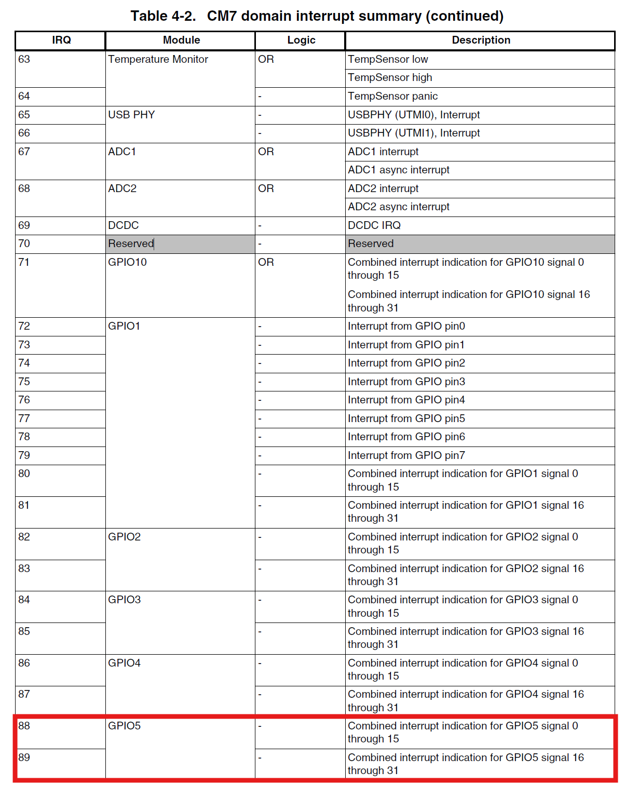

# NXP_RoboLearn

## Przerwania w Zephyr RTOS

W Zephyr RTOS przerwania GPIO są obsługiwane za pomocą API GPIO. Poniżej znajduje się opis kroków potrzebnych do skonfigurowania przerwań GPIO oraz szczegóły działania używanych funkcji.

---

### Krok 1: Definicja pinu GPIO w Device Tree

W Device Tree należy upewnić się, że kontroler GPIO oraz pin są poprawnie skonfigurowane. Przykład dla GPIO5 i pinu 0:

- Konfiguracja w pliku `mimxrt1064_evk.dts` mówi nam który kontroler gpio odpowiada za obsługę przycisku oraz do którego pinu jest przypisany: 
```dts
gpio_keys {
    compatible = "gpio-keys";
    user_button: button-1 {
        label = "User SW8";
        gpios = <&gpio5 0 (GPIO_PULL_UP | GPIO_ACTIVE_LOW)>;
        zephyr,code = <INPUT_KEY_0>;
    };
};
```

- Następnie po zbudowaniu projektu możemy przeszukać plik `build\zephyr\zephyr.dts` pod kątem kontrolera `gpio5`. W tym pliku znajduje się pełna konfiguracja DeviceTree dla naszego urządzenia:
```dts
gpio5: gpio@400c0000 {
    compatible = "nxp,imx-gpio";
    reg = < 0x400c0000 0x4000 >;
    interrupts = < 0x58 0x0 >, < 0x59 0x0 >;
    gpio-controller;
    #gpio-cells = < 0x2 >;
    pinmux = < &iomuxc_snvs_wakeup_gpio5_io00 >, < &iomuxc_snvs_pmic_on_req_gpio5_io01 >, < &iomuxc_snvs_pmic_stby_req_gpio5_io02 >;
    phandle = < 0x17d >;
};
```
W tej części istotnym dla mas kodem jest fragment `interrupts = < 0x58 0x0 >, < 0x59 0x0 >;` definiuje on dwa numery przerwań (`0x58` oraz `0x59`). Są to to unikalne identyfikatory pozwalające procesorowi rozpoznać, które urządzenie wywołało przerwanie. Często są stosowane jako indeksy w wektorze obługi przerwań procesora, które wskazują na funkcjie ISR obsługujące dane przerwanie. Oznacza to że kontroler GPIO5 obsługuje dwa różne przerwania, z których każde może być przypisane do konkretnego pinu lub grupy pinów w ramach kontrolera GPIO.

W `Reference Manual` do płytki `mimxrt1064_evk` możemy wyczytać, który numer przerwania odpowiada naszemu przyciskowi (`&gpio5 0`).



Jak widać w tabeli do pinu 0 kontrolera *GPIO5* używany jest numer 88.

### Krok 2: Pobranie kontrolera GPIO i skonfigurowanie jako wejście

### Krok 3: Konfiguracja przerwań GPIO

### Krok 4: Zdefiniowanie ISR obsługującej przerwanie

### Krok 5: Rejestracja callbacku

