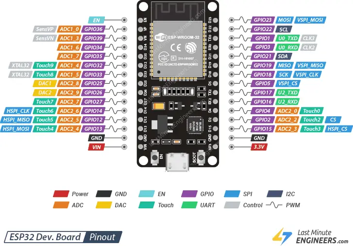
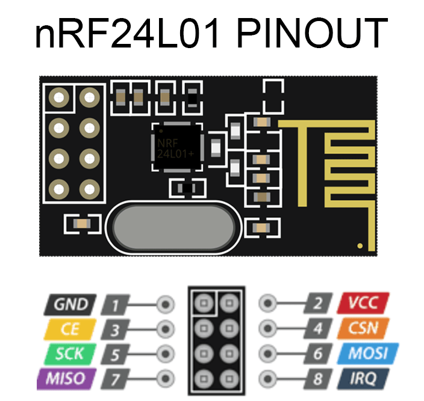

# Projekt NXP_RoboLearn

## Opis
Ten projekt to zdalny pilot do sterowania robotem za pomocą joysticka Thumb Joystick v2 i modułu radiowego nRF24L01. Sterowanie odbywa się poprzez odczyt danych z joysticka (pozycja osi X, Y oraz przycisk) i przesyłanie ich do odbiornika zamontowanego na robocie za pomocą protokołu SPI i komunikacji radiowej.

## Wykorzystywane moduły i komponenty

- **ESP32 DevKit V1** - mikrokontroler odpowiedzialny za obsługę joysticka i komunikację radiową.
- **nRF24L01** - moduł radiowy do przesyłania danych między pilotem a robotem.
- **Thumb Joystick z przyciskiem v2** - moduł joysticka do sterowania robotem.

Oprogramowanie napisane przy użyciu **Arduino IDE** oraz biblioteki `NRF` od `TMRh20`.

## Schemat połączeń

| Moduł/Komponent           | Pin na module      | Pin na ESP32 DevKit V1  | Opis                        |
|---------------------------|--------------------|-------------------------|-----------------------------|
| **Joystick**              | VCC                | 3.3V                    | Zasilanie joysticka         |
|                           | GND                | GND                     | Masa                        |
|                           | VRX                | GPIO4                   | Odczyt osi X                |
|                           | VRY                | GPIO15                  | Odczyt osi Y                |
|                           | SW                 | GPIO32                  | Stan przycisku              |
| **nRF24L01**              | VCC                | 3.3V                    | Zasilanie modułu            |
|                           | GND                | GND                     | Masa                        |
|                           | CE                 | GPIO33                  | Tryb pracy                  |
|                           | CSN (CS)           | GPIO5                   | Wybór urządzenia SPI        |
|                           | SCK                | GPIO18                  | Zegar SPI                   |
|                           | MOSI               | GPIO23                  | Dane do modułu (Master Out) |
|                           | MISO               | GPIO19                  | Dane z modułu (Master In)   |

## Pinout płytki **ESP32 DevKit V1**

## Pinout **nRF24L01**

