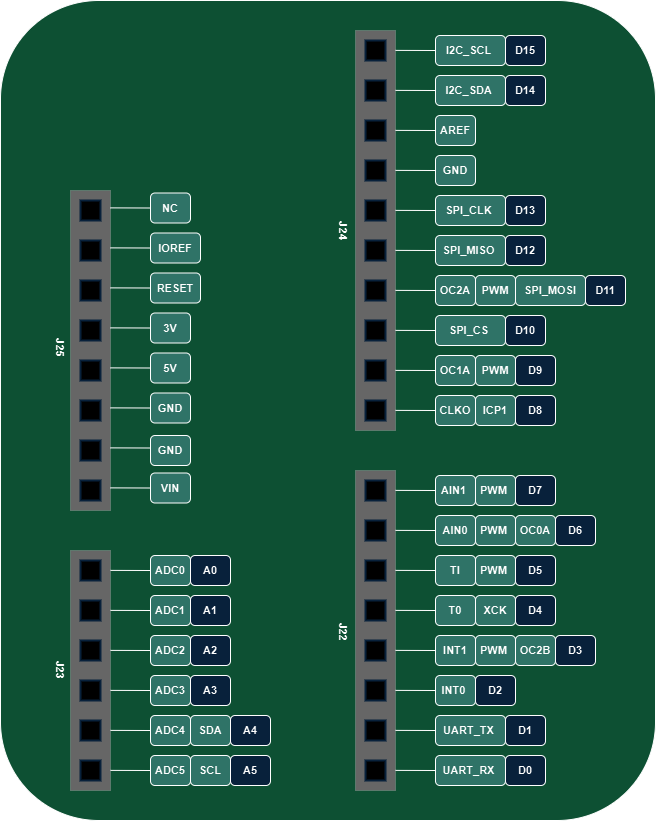
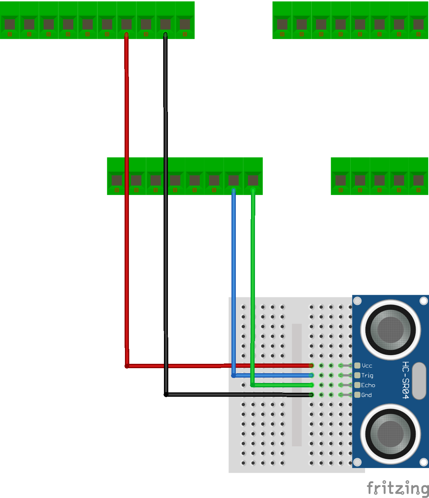

# Lab 2 - Serial

## Wstęp

1. MIMXRT1064_EVK Pinout:



2. Wykorzystywane moduły i ich dokumentacje
 - Ultradżwiękowy czujnik odległości **HC-SR04** : [Datasheet](https://cdn.sparkfun.com/datasheets/Sensors/Proximity/HCSR04.pdf)
 - Czujnik dbiciowy optyczny **ST1140**: [Datasheet](https://cdn-reichelt.de/documents/datenblatt/C200/ST1140.pdf)
 - Wyświetlacz LCD 1.8'' **ST7735S**: [Datasheet]()
 - Czujnik temperatury i wilgotności **AHT20**: [Datasheet]()
 - Moduł radiowy **nRF24L01**: [Datasheet](http://www.nordicsemi.com/eng/Products/2.4GHz-RF/nRF24L01)

## Device Tree w Zephyr

**DTS (Device Tree Source)** - to struktura opisująca sprzętową konfigurację mikrokontrolera w systemie Zephyr. DTS jest plikiem tekstowym, który zawiera informacje o sprzęcie, takie jak piny GPIO, kontrolery, interfejsy SPI czy UART, itp. W uproszczeniu pliki źródłowe DTS są używane do wygenerowania pliku nagłówkowego w formacie `.h`. Zawartość wygenerowanego nagłówka jest abstrahowana przez API `devicetree.h`, którego można użyć do uzyskania informacji z devicetree.

DTS w Zephyr składa się z następujących elementów:

- Sources (`.dts`) - to główne pliki opisujące konfigurację sprzętową dla danej płytki. Określają, które urządzenia są włączone (status = "okay") i przypisują odpowiednie piny. Na przykład aktywuje pierwszy interfejs I2C i przypisuje mu konfigurację pinów zdefiniowaną w pliku `.dtsi`. `aht20@38` Deklaruje czujnik AHT20 podłączony do lpi2c1 z adresem 0x38
```dts
&lpi2c1 {
    status = "okay";
    pinctrl-0 = <&pinmux_lpi2c1>;
    pinctrl-names = "default";

    aht20: aht20@38 {
        compatible = "aosong,aht20";
        reg = <0x38>;
    };
};
```

- Includes (`.dtsi`) - zawierają ogólne/wspólne dane, które mogą być współdzielone przez wiele plików dts. Każdy plik dts zawiera jeden lub wiele plików dtsi i wprowadza zmiany specyficzne dla tego pliku dts. Na przykład definiuje szczegóły konfiguracji pinów dla `lpi2c1`, takie jak funkcje pinów, tryb pracy czy siła sygnału.
```dts
  pinctrl_lpi2c1: pinmux_lpi2c1 {
    group0 {
        pinmux = <&iomuxc_gpio_ad_b1_01_lpi2c1_sda>,
                 <&iomuxc_gpio_ad_b1_00_lpi2c1_scl>;
        drive-strength = "r0-6";
        drive-open-drain;
        nxp,speed = "100-mhz";
    };
};
```
- Overlays (`.overlay`) -  pozwalają modyfikować lub rozszerzać konfigurację sprzętową zdefiniowaną w plikach `.dts` i `.dtsi`. Są używane do wprowadzania zmian specyficznych dla aplikacji, bez potrzeby edytowania oryginalnych plików. Na przykład modyfikuje istniejący węzeł lpi2c1 dodając do niego konfigurację dla czujnika AHT20.
```dts
&lpi2c1 {
    status = "okay";
    aht20: aht20@38 {
        compatible = "aosong,aht20";
        reg = <0x38>;
    };
};
```  

- Bindings (`.yaml`) - zawierają tzw. "bindings", czyli metadane opisujące, jak DTS ma być interpretowane przez Zephyra. Określają, jakie właściwości (properties) są wymagane, jakie są ich domyślne wartości, i jak mają być mapowane na funkcje w systemie. Na przykład informuje Zephyra, że urządzenie z compatible = "aosong,aht20" to czujnik AHT20 i wymaga właściwości reg (adresu I2C).
```yaml
compatible: "aosong,aht20"
description: AHT20 temperature and humidity sensor
properties:
  reg:
    type: int
    required: true
    description: I2C address of the device
  reset-gpios:
    type: phandle-array
    required: false
    description: GPIO pin to reset the sensor
```

## Plik `mimxrt1064_evk.dts`

1. **Aliasy** - umożliwiają tworzenie alternatywnych nazw dla węzłów (ang. nodes), co upraszcza odwoływanie się do nich w kodzie.
```dts
	aliases {
		led0 = &green_led;
		pwm-led0 = &green_pwm_led;
        ...
	};
```
Dzięki temu w kodzie możesz używać `DT_ALIAS(led0)` zamiast `DT_NODELABEL(green_led)`, co jest bardziej czytelne.

2. **chosen** - wskazuje domyślne urządzenia lub konfiguracje, które mają być używane przez system.
```dts
chosen {
    zephyr,uart-mcumgr = &lpuart1;
    zephyr,console = &lpuart1;
    zephyr,shell-uart = &lpuart1;
    zephyr,canbus = &flexcan2;
};
```
Na przykład `zephyr,console = &lpuart1;` ustawia `lpuart1` jako domyślne urządzenie  konsoli. Dzięki temu używając `printf()` czy `cout` w kodzie dane będą wypisywane na `lpuart1`.

3. **nodes** - definiują węzły, które reprezentują urządzenia sprzętowe. Każdy węzeł ma swoje właściwości (properties), które opisują konfigurację sprzętową urządzenia.
```dts
nxp_i2c_touch_fpc: i2c-touch-connector {
    compatible = "nxp,i2c-tsc-fpc";
    #gpio-cells = <2>;
    gpio-map-mask = <0xffffffff 0xffffffc0>;
    gpio-map-pass-thru = <0 0x3f>;
    gpio-map =	<1  0 &gpio1 2 0>,	/* Pin 2, LCD touch RST */
            <2  0 &gpio1 11 0>;	/* Pin 3, LCD touch INT */
};
```
Węzeł `nxp_i2c_touch_fpc` reprezentuje interfejs I2C do ekranu dotykowego. Właściwość `compatible` określa, że jest to interfejs do ekranu dotykowego firmy NXP. Właściwość `#gpio-cells` określa, że węzeł ma dwa elementy typu `gpio`. Właściwość `gpio-map` przypisuje piny GPIO do konkretnych funkcji.

```dts
leds {
    compatible = "gpio-leds";
    green_led: led-1 {
        gpios = <&gpio1 9 GPIO_ACTIVE_LOW>;
        label = "User LD1";
    };
};
```
Węzeł leds opisuje diody LED obsługiwane przez GPIO na płytce. W tym przypadku opisuje pojedynczą diodę LED oznaczoną jako green_led.
- `compatible = "gpio-leds";` - Informuje, że ten węzeł jest kompatybilny z generatorem sterowników dla diod LED sterowanych przez GPIO.
- `green_led: led-1 {}` - Definiuje konkretną diodę LED o nazwie `green_led` i przypisuje jej alias `led-1`.

## Urządzenia nie wymagające protokołu komunikacyjnego
Zaczynamy od urządzeń nie wymagających konkretnego protokołu komunikacyjnego, ponieważ są one prostsze w implementacji i pozwalają na szybkie zapoznanie się z działaniem komunikacji szeregowej. Urządzenia te posiadają własne uproszczone protokoły, które zwykle sprowadzają się do ustawienia jakiejś wartości na pinie i oczekiwaniu aż moduł zwróci jakieś dane. Oznacza to że przujmują one jedynie proste komendy wymagające odczytu stanu na danym pinie.

Te moduły to: **HC-SR04** oraz **ST1140**.

## Przykład 1: Czujnik odległości HC-SR04



| Pin na płytce NXP | Pin na module HC-SR04 |
|-------------------|-----------------------|
| GND               | GND                   |
| 5V                | VCC                   |
| GPIO A4           | TRIG                  |
| GPIO A5           | ECHO                  |

**Uwaga**: Pamiętaj aby podłaczanie modułów do płytki odbywało się bez podłączenia do źródła prądu oraz zawsze najpierw podłączaj uziemienie GND.
---

### Działanie modułu HC-SR04
Moduł HC-SR04 to ultradźwiękowy czujnik odległości, który mierzy czas przelotu fal dźwiękowych między czujnikiem a przeszkodą, co pozwala na obliczenie odległości. Działa w dwóch etapach:
1. **Wysyłanie impulsu** – Czujnik generuje krótki impuls ultradźwiękowy o częstotliwości 40 kHz przez pin *TRIG*, który trwa 10 mikrosekund.

2. **Odbiór echa** – Jeśli fala dźwiękowa odbije się od przeszkody, czujnik rejestruje czas powrotu sygnału na pinie ECHO. Na podstawie tego czasu można obliczyć odległość od przeszkody, używając wzoru:
$$
\text{odległość [m]} = \frac{\text{czas [s]} \times \text{prędkość dźwięku w powietrzu} \left[ \frac{m}{s} \right]}{2}
$$

Oznacza to że programistycznie aby mierzyć odległość musimy:
1. Ustawić pin *TRIGG* na stan wysoki na 10 mikrosekund.
2. Po wysłaniu fali czujnik odrazu ustawi pin ECHO w stan wysoki.
3. Gdy fala wróci czujnik zmieni stan pinu ECHO na niski. 
4. Nasz program musi zmierzyć czas trwania sygnału wysokiego na pinie ECHO i obliczyć odległość z powyższego wzoru.

### Kwestie Hardware

Każdy hardware ma swoje mankamenty, które należy odpowiednio obsłużyć programowo. W tym przypadku jest to mierzenie odległości zerowej. Jeżeli przyłożymy przedmiot do czujnika odczytany pomiar czasu może okazać się wyjątkowo duży. Może to wynikać na przykład z tego, że czujnik nie rejestruje odbicia sygnału, mierzony czas trwa aż do osiągnięcia limitu. Z dokumentacji możemy wyczytać że czujnik jest w stanie mierzyć doległości od 2cm do 400cm co oznacza, nie wiemy jakie otrzymamy odczyty przy odległościach wykraczających poza zakres. Musimy to sprawdzić i odpowiednio oprogramować.

### Konfiguracja pinów
Aby nasz mały program był ciekawszy dodamy moduł aktywnego Buzzera aby symulować działanie czujnika parkowania w samochodzie.

| Pin na płytce NXP | Pin na module         | Pin w strukturze DTS |
|-------------------|-----------------------|----------------------|
| GND               | GND (HCSR04 i Buzzer) | &gpio1 0             |
| 5V                | VCC (HCSR04)          | &gpio1 1             |
| GPIO A3           | +    (Buzzer)         | &gpio1 21            |
| GPIO A4           | TRIG (HCSR04)         | &gpio1 17            |
| GPIO A5           | ECHO (HCSR04)         | &gpio1 16            |

Przykładowy kod implementujący działanie czujnika odległości z pikającym Buzzerem znajduje się w pliku `main_hcsr04.cpp`. 
 - Skompiluj go i uruchom na płytce.
 - Sprawdź odczyty odległości jak zmienia się ona oraz jakie się odczyty gdy dotkniemy przedmiotem do czujnika
 - Dodaj więcej trybów "pikania" aby czujnik dawał więcej informacji co do odległości
 - Zamień buzzer na diodę (pamiętaj o odpowiednim rezystorze!)

## Przykład 2: czujnik odbiciowy ST1140
Czujnik odbiciowy światła ST1140 działa, emitując wiązkę światła podczerwonego (IR) z wbudowanej diody LED. Gdy wiązka ta odbije się od powierzchni i wróci do fotodetektora (fototranzystora lub fotodioda), czujnik wykrywa obecność obiektu. Jest często używany do detekcji linii lub obiektów na krótkim dystansie, na przykład w robotyce do śledzenia linii.

| Pin na płytce NXP | Pin na module HC-SR04 |
|-------------------|-----------------------|
| GND               | GND                   |
| 5V                | VCC                   |
| GPIO A5           | S                     |

---

### Działanie modułu HC-SR04
Gdy wiązka światła odbija się od obiektu, który znajduje się w zasięgu, sygnał na wyjściu czujnika zmienia się. W zależności od koloru i rodzaju powierzchni obiektu, intensywność odbitego światła może być różna. Czarny kolor pochłania światło, więc zwraca mniejszy sygnał, podczas gdy jasne kolory odbijają go lepiej.

Aby oprogramować moduł musimy:
 - Skonfigurować pin wejściowy
 - Odczytywać w pętli stan pinu
 - Wypisać informacje na konsole aby sprawdzić działanie

 ### Ćwiczenie
 Oprogramuj moduł tak aby zwrócił informację czy napotkał kolor pochłaniający czy odbijający. Pamiętaj o użyciu poprawnych flag przy konfiguracji pinu wejściowego aby zapobiec niestabilności sygnału, gdy nie ma odbicia. Przykładowy kod znajdziesz w pliku `main_st1140.cpp`.


 ## Interfejs I2C z użyciem modułu AHT40

### Ćwiczenie

W tym ćwiczeniu zbudujemy bardziej zaawansowany program, który będzie korzystał z kilku plików źródłowych. Taki podział pozwala na lepszą organizację kodu, ułatwia jego utrzymanie oraz testowanie poszczególnych modułów. Program będzie dotyczył komunikacji I2C z użyciem modułu AHT40, który jest czujnikiem temperatury i wilgotności. W ramach ćwiczenia nauczymy się, jak skonfigurować interfejs I2C, jak komunikować się z modułem AHT40 oraz jak odczytywać i interpretować dane z tego czujnika. Przykładowy kod znajdziesz w plikach `main_i2c.cpp`, `aht40.cpp`, `aht40.h` oraz `mimxrt1064_evk.overlay`.

#### Konfiguracja interfejsu I2C
W pliku `mimxrt1064_evk.overlay` dodajemy konfigurację interfejsu I2C dla modułu AHT40:
-  