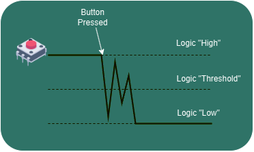
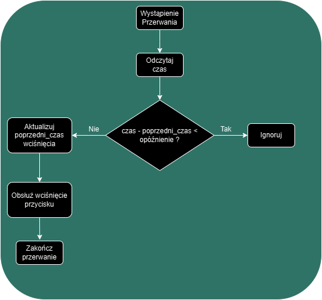

# NXP_RoboLearn

## Przerwania w Zephyr RTOS

W Zephyr RTOS przerwania GPIO są obsługiwane za pomocą API GPIO. Poniżej znajduje się opis kroków potrzebnych do skonfigurowania przerwań GPIO oraz szczegóły działania używanych funkcji.

---

### Krok 1: Definicja pinu GPIO w Device Tree

W Device Tree należy upewnić się, że kontroler GPIO oraz pin są poprawnie skonfigurowane. Przykład dla GPIO5 i pinu 0:

- Konfiguracja w pliku `mimxrt1064_evk.dts` mówi nam który kontroler gpio odpowiada za obsługę przycisku oraz do którego pinu jest przypisany: 
```dts
gpio_keys {
    compatible = "gpio-keys";
    user_button: button-1 {
        label = "User SW8";
        gpios = <&gpio5 0 (GPIO_PULL_UP | GPIO_ACTIVE_LOW)>;
        zephyr,code = <INPUT_KEY_0>;
    };
};
```

- Następnie po zbudowaniu projektu możemy przeszukać plik `build\zephyr\zephyr.dts` pod kątem kontrolera `gpio5`. W tym pliku znajduje się pełna konfiguracja DeviceTree dla naszego urządzenia:
```dts
gpio5: gpio@400c0000 {
    compatible = "nxp,imx-gpio";
    reg = < 0x400c0000 0x4000 >;
    interrupts = < 0x58 0x0 >, < 0x59 0x0 >;
    gpio-controller;
    #gpio-cells = < 0x2 >;
    pinmux = < &iomuxc_snvs_wakeup_gpio5_io00 >, < &iomuxc_snvs_pmic_on_req_gpio5_io01 >, < &iomuxc_snvs_pmic_stby_req_gpio5_io02 >;
    phandle = < 0x17d >;
};
```
W tej części istotnym dla mas kodem jest fragment `interrupts = < 0x58 0x0 >, < 0x59 0x0 >;` definiuje on dwa numery przerwań (`0x58` oraz `0x59`). Są to to unikalne identyfikatory pozwalające procesorowi rozpoznać, które urządzenie wywołało przerwanie. Często są stosowane jako indeksy w wektorze obługi przerwań procesora, które wskazują na funkcjie ISR obsługujące dane przerwanie. Oznacza to że kontroler GPIO5 obsługuje dwa różne przerwania, z których każde może być przypisane do konkretnego pinu lub grupy pinów w ramach kontrolera GPIO.

W `Reference Manual` do płytki `mimxrt1064_evk` możemy wyczytać, który numer przerwania odpowiada naszemu przyciskowi (`&gpio5 0`).


Jak widać w tabeli do pinu 0 kontrolera *GPIO5* używany jest numer 88.

### Krok 2: Pobranie kontrolera GPIO i skonfigurowanie jako wejście

Dla uproszczenia kodu korzystamy z struktur devicetree (DT) zdefiniowanych w `mimxrt1064_evk.dts`:

```C++
static const struct gpio_dt_spec button = GPIO_DT_SPEC_GET(DT_NODELABEL(user_button), gpios);
static const struct gpio_dt_spec led = GPIO_DT_SPEC_GET(DT_NODELABEL(green_led), gpios);

int ret = gpio_pin_configure_dt(&button, GPIO_INPUT);
```

### Krok 3: Rejestracja przerwania GPIO

Konfigurujemy przerwanie w następujący sposób:
- `GPIO_INT_EDGE_TO_ACTIVE` - przerwanie wywoływane jest gdy stan pinu zmienia się z niskiego na wysoki

Funkcja "pod spodem" ustawia rejestry sprzętowe w celu wykrywania określonego zbocza, włącza maskę przerwań dla pinu przycisku oraz rejestruje przerwanie w systemie Zephyr. Wszystko to dzieje się automatcznie dzięki API kontrolera GPIO.
```C++
ret = gpio_pin_interrupt_configure_dt(&button, GPIO_INT_EDGE_TO_ACTIVE);
```

### Krok 4: Zdefiniowanie ISR obsługującej przerwanie

Aby nasze przerwanie "coś" robiło musimy zdefiniować funckcję obsługi przerwania czyli **Interrupt Service Routine**. W implementacji używa się określenia *callback*. Powinna to być szybka i zoptymalizowana funkcja aby zapewnić responsywność systemu. W naszym przykładzie będzie to funckja zmieniająca stan diody led za pomocą `gpio_pin_toggle_dt()` oraz wypisująca informację w konsoli.

**Uwaga** Jak pamiętamy z poprzednich skryptów funkcje wypisujące do konsoli są bardzo kosztowne da procesora dlatego nidy nie powinno się ich używać w callbackach przerwań. W naszym przypadku jest to jedynie cel demonstracyjny.

```C++
static void button_pressed(const struct device *dev, struct gpio_callback *cb, uint32_t pins)
{
    gpio_pin_toggle_dt(&led);
    printk("Przycisk wciśnięty! Zmieniam stan LED\n");
}
```

### Krok 5: Rejestracja callbacku

Gdy już mamy skonfigurowany pin z przerwaniem oraz zdefiniowaną funkcję obsługi przerwania, możemy zarejestrować callback w systemie Zephyr. Używamy do tego funkcji `gpio_init_callback()` oraz `gpio_add_callback()`.

```C++
gpio_init_callback(&button_cb_data, button_pressed, BIT(button.pin));
gpio_add_callback(button.port, &button_cb_data);
```

### Podsumowanie

Po tych krokach możemy uruchomić nasz program. W pętli głównej uśpimu proces głowny aby nie robił nic i czekał na wystąpienie przerwania za pomocą funckji `k_sleep()`. W momencie wciśnięcia przycisku dioda LED powinna zmienić stan oraz w konsoli powinna pojawić się informacja o wciśnięciu przycisku.

```C++
while (1) {
    k_sleep(K_FOREVER); // Proces główny pozostaje w uśpieniu
}
```

---

## Debouncing w przerwaniach GPIO

### Drgania styków przycisków

Gdy przycisk jest wciskany, styki wewnątrz przycisku mogą wielokrotnie odbijać się od siebie, zanim osiągną stabilny stan. To zjawisko nazywane jest drganiami styków (ang. bounce). W efekcie, zamiast jednego przejścia z niskiego stanu logicznego do wysokiego (lub odwrotnie), możemy zaobserwować serię szybkich przejść, które mogą być błędnie interpretowane przez system jako wielokrotne naciśnięcia przycisku.

Bez odpowiedniego debouncingu, system może reagować na każde z tych szybkich przejść, co prowadzi do niepożądanych efektów, takich jak wielokrotne wywołanie przerwania lub wykonanie akcji przypisanej do przycisku.



### Jak działa debouncing?

Debouncing można realizować na dwa sposoby: sprzętowo i programowo.

1. **Debouncing sprzętowy**

Debouncing sprzętowy polega na użyciu dodatkowych komponentów elektronicznych, takich jak kondensatory i rezystory, które filtrują szybkie zmiany sygnału, pozwalając tylko na stabilne przejścia. Jest to skuteczna metoda, ale wymaga dodatkowych elementów na płytce drukowanej.

2. **Debouncing programowy**

Debouncing programowy polega na implementacji algorytmu w kodzie, który ignoruje szybkie zmiany sygnału w krótkim okresie czasu. Przykładowo, po wykryciu zmiany stanu przycisku, program może odczekać określony czas (np. 10-50 ms) i ponownie sprawdzić stan przycisku, aby upewnić się, że jest stabilny. Dopiero wtedy zmiana stanu jest uznawana za prawidłową.

Poniżej schemat blokowy takiego rozwiązania:




## **Ćwiczenie 1**

W projekcie `Button_interrupt` zaimplementuj mechanizm debouncingu. Zdefinuj stałą zmienną `DEBOUNCE_DELAY_MS` i użyj jej w procedurze obsługi przerwania. Skorzystaj z funkcji zephyra do pomiaru czasu:

```C++
k_uptime_get_32(); // Pobierz czas w ms
```

## **Ćwiczenie 2**

Wróćmy do implementacji komunikacji szerwgoej z modułem NRF24L01. Dokończ implementację funckji callback która odbirze dane wysyłane z joysticka. Wypisz na konsoli wartości otrzymanych danych.